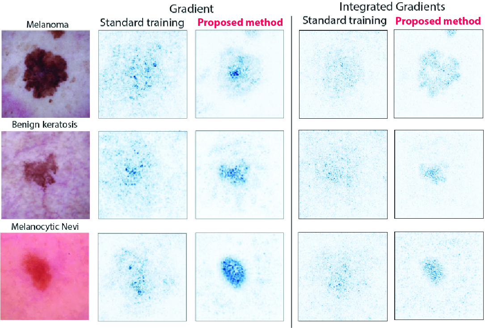

# Improving Interpretability in Medical Imaging Diagnosis using Adversarial Training
[](https://github.com/a-norcliffe/sonode/blob/master/LICENSE) [](https://www.python.org/downloads/release/python-370/)

Official code for the NeurIPS 2020 Workshop paper [**Improving Interpretability in Medical Imaging Diagnosis using Adversarial Training**](https://arxiv.org/abs/2012.01166) ([Andrei Margeloiu](https://twitter.com/andreimargeloiu), 
 [Nikola Simidjievski](https://simidjievskin.github.io/), 
 [Mateja Jamnik](https://www.cl.cam.ac.uk/~mj201/),
 [Adrian Weller](http://mlg.eng.cam.ac.uk/adrian/))


[**SlidesShare VIDEO presentation**](https://slideslive.com/38942990/improving-the-interpretability-in-medical-imaging-diagnosis-using-adversarial-training)




## Abstract
We investigate the influence of adversarial training on the interpretability of convolutional neural networks (CNNs), specifically applied to diagnosing skin cancer. We show that gradient-based saliency maps of adversarially trained CNNs are significantly sharper and more visually coherent than those of standardly trained CNNs. Furthermore, we show that adversarially trained networks highlight regions with significant color variation within the lesion, a common characteristic of melanoma. We find that fine-tuning a robust network with a small learning rate further improves saliency maps' sharpness. Lastly, we provide preliminary work suggesting that robustifying the first layers to extract robust low-level features leads to visually coherent explanations.


## Getting started
We used `python 3.7` for this project. All packge requirements were frozen in `requirements.txt`

### **Google Colab** (fastest way)
1. https://colab.research.google.com/
2. File -> Open notebook -> Github -> paste the link of this repository https://github.com/margiki/Interpretability-Adversarial
3. Open the /notebooks/evaluate_model.ipynb
4. Download the [trained models and data splits](https://drive.google.com/file/d/1t4pozXp_AhoAZz5UShI3iwGZ-ncF9aSI/view?usp=sharing) and upload them to your personal Google Drive (you will need to provide the path to your Google Drive in the notebooks)
5. Enjoy! The scripts automatically installs all package requirements in Google Colab.


### Locally:
Download the [trained models and data splits](https://drive.google.com/file/d/1t4pozXp_AhoAZz5UShI3iwGZ-ncF9aSI/view?usp=sharing) and upload them to your personal Google Drive (you will need to provide the path to your Google Drive in the notebooks)
```bash
cd PATH_TO_THE_PROJECT
conda create -n robustness python=3.7
pip install requirements.txt
```


## Citation
For attribution in academic contexts, please cite this work as
```
@article{margeloiu2020adversarial,
	title="Improving Interpretability in Medical Imaging Diagnosis using Adversarial Training",
	author={Andrei {Margeloiu} and Nikola {Simidjievski} and Adrian {Weller} and Mateja {Jamnik}},
	journal="34th Conference in Advances in Neural Information Processing Systems (NeurIPS) Workshop: Medical Imaging meets NeurIPS",
	year="2020"
}
```

### References
The subfolder `./robustness` is forked from https://github.com/MadryLab/robustness. I implemented some changes (e.g. run on CPU, custom datasets and models) that were useful in this project.

### Known bugs:
There is a (known bug)[https://github.com/pytorch/captum/issues/393] in the Pytorch Captum library v0.2.0, which doesn't rescale the values in the saliency map when they are too small. This makes the display saliency map to be all white.
To fix this bug:
1. Open the file: "captum/attr/_utils/visualization.py"
2. Delete lines 42-47
3. Now you solved the bug and can run this project smoothly.